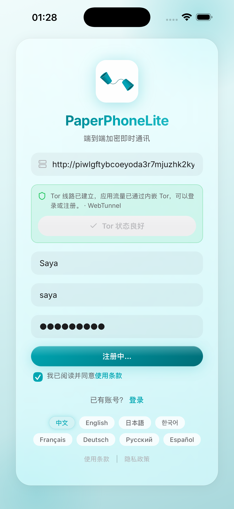
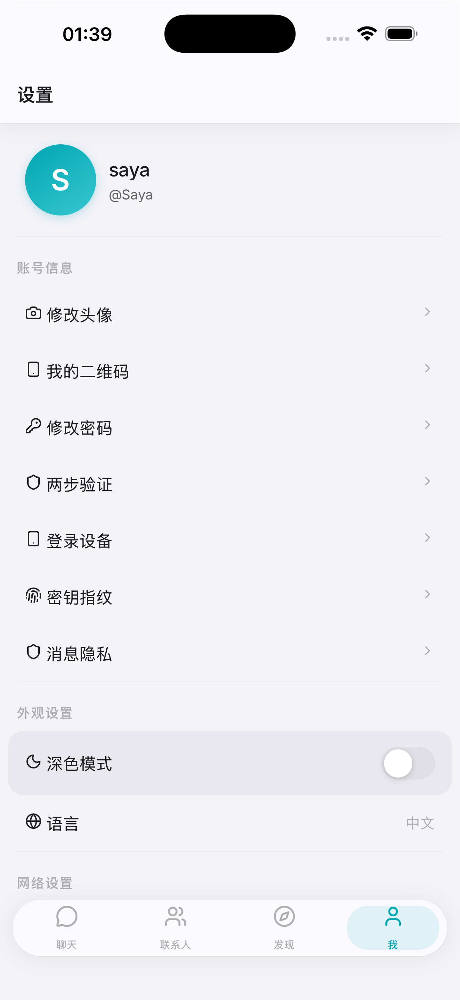
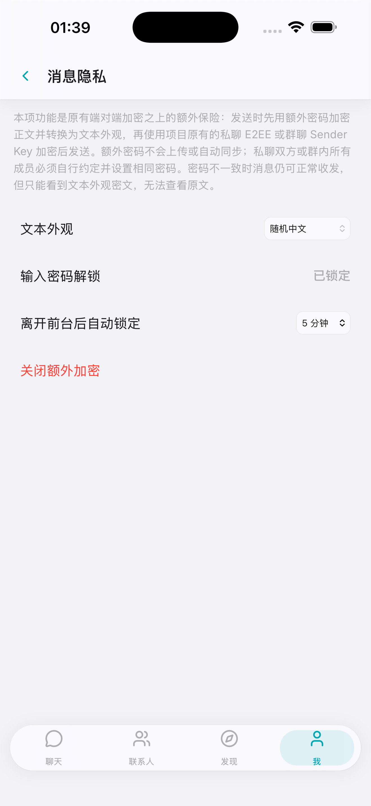

# PaperPhoneLite 3.0.13

[简体中文](README.md) · [English](README_EN.md) · [日本語](README_JA.md) · [한국어](README_KO.md) · [Français](README_FR.md) · [Deutsch](README_DE.md) · [Русский](README_RU.md) · [Español](README_ES.md)

[История изменений](changelog.md)

PaperPhoneLite — лёгкий мессенджер со сквозным шифрованием без публичных социальных функций.

Скриншоты приложения

## Возможности

- Гибридное согласование ключей X25519 + ML-KEM-768, XSalsa20-Poly1305 и проверка номера безопасности.
- Личные чаты и группы до 2 000 участников с шифрованием Sender Key.
- Текст, изображения, видео, документы, голосовые сообщения, эмодзи и стикеры Telegram.
- Надёжная WebSocket-синхронизация, офлайн-очередь и раздельный кэш аккаунтов.
- Автоудаление сообщений через 1, 3, 7 или 30 дней.
- Заявки в друзья, заметки, теги, блокировка и QR-приглашения в группы.
- TOTP 2FA и дополнительные фоновые уведомления через ntfy на Android. Клиент iOS не использует APNs и сейчас не поддерживает системные фоновые push-уведомления.
- Файлы до 500 МБ хранятся только в постоянном томе сервера; вложения загружаются через Rust-сервер без открытия адресов объектного хранилища или `.onion` во внешнем браузере и могут быть сохранены через системное меню телефона.
- Восемь языков интерфейса.

## Tor обязателен

Рабочие клиенты Android, iOS, Windows и macOS должны встраивать Tor, ждать завершения bootstrap до входа и направлять `.onion` через изолированные SOCKS5-цепочки без перехода в clearnet. `client/` содержит только общий исходный код интерфейса. Браузеры и PWA не поддерживаются как рабочие клиенты.

Moments, Timeline, все звонки, LiveKit, Cloudflare R2, жалобы и панель модерации удалены. В рабочей среде используются только Docker Compose и Tor v3 onion service. См. [DEPLOY_EN.md](DEPLOY_EN.md).

После запуска Docker Compose контейнер Tor автоматически записывает полный адрес `http://...onion` в файл `logs/onion-address.log` на хосте; адрес также выводится командой `docker compose logs tor`.

Приложение iOS предназначено для публикации в Apple App Store. APK для Android распространяются только через [GitHub Releases](https://github.com/619dev/ppl-android/releases) репозитория Android-клиента, не публикуются в Google Play и не содержат push- или сервисных фреймворков Google.

## Репозитории клиентов

| Платформа | Исходный код и релизы |
|-----------|-----------------------|
| Android | [619dev/ppl-android](https://github.com/619dev/ppl-android) |
| iOS | [619dev/ppl-ios](https://github.com/619dev/ppl-ios) |
| macOS | [619dev/ppl-mac](https://github.com/619dev/ppl-mac) |
| Windows | [619dev/ppl-win](https://github.com/619dev/ppl-win) |

Если проект оказался полезен, угостите меня банкой колы.

Группа Telegram: https://t.me/+vHJtvWJY_gEyMTUx

Лицензия: AGPL-3.0.
